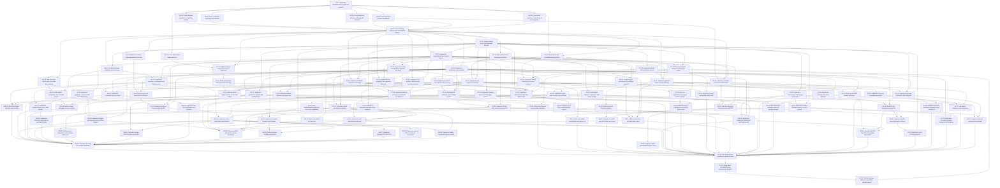

# Task dependency graph

Generated from [tasks.json](tasks.json). An edge means the destination depends on the source. Use [the roadmap](ROADMAP.md) for readable lane guidance.

```mermaid
flowchart TD
  F1_01["F1-01: Bootstrap workspace and scoped test runners"]
  S0_01["S0-01: Prove launcher activation and desktop identity"]
  F1_01 --> S0_01
  S0_02["S0-02: Prove compositor and clipboard transport"]
  F1_01 --> S0_02
  S0_03["S0-03: Prove native input failure recovery"]
  F1_01 --> S0_03
  S0_04["S0-04: Prove extension sandbox boundaries"]
  F1_01 --> S0_04
  S0_05["S0-05: Prove streaming provider and approval lifecycle"]
  F1_01 --> S0_05
  S0_06["S0-06: Prove visual workflow and declarative view integration"]
  F1_01 --> S0_06
  F0_01["F0-01: Freeze shared contracts and compatibility fixtures"]
  S0_01 --> F0_01
  S0_02 --> F0_01
  S0_04 --> F0_01
  S0_05 --> F0_01
  S0_06 --> F0_01
  F1_02["F1-02: Build resident shell and secure windows"]
  F0_01 --> F1_02
  F2_01["F2-01: Create storage owner and migration lifecycle"]
  F0_01 --> F2_01
  F2_02["F2-02: Implement secrets and local data controls"]
  F2_01 --> F2_02
  F3_01["F3-01: Implement capability and permission brokers"]
  F0_01 --> F3_01
  F2_01 --> F3_01
  D1_01["D1-01: Bind tokens and accessible host primitives"]
  F1_01 --> D1_01
  F0_01 --> D1_01
  D1_02["D1-02: Implement declarative view renderer"]
  D1_01 --> D1_02
  F0_01 --> D1_02
  D1_03["D1-03: Implement shared settings and consent surfaces"]
  D1_01 --> D1_03
  F3_01 --> D1_03
  F2_02 --> D1_03
  F1_03["F1-03: Package bundled runtimes and desktop assets"]
  F1_02 --> F1_03
  F2_01 --> F1_03
  L1_01["L1-01: Implement root registry and ranking"]
  F1_02 --> L1_01
  F2_01 --> L1_01
  D1_02 --> L1_01
  L1_02["L1-02: Discover applications and typed launch actions"]
  L1_01 --> L1_02
  F3_01 --> L1_02
  L1_03["L1-03: Implement aliases, shortcuts and deep links"]
  L1_01 --> L1_03
  D1_03 --> L1_03
  P1_01 --> L1_03
  L2_01["L2-01: Build file metadata index and watcher recovery"]
  F2_01 --> L2_01
  F0_01 --> L2_01
  L2_02["L2-02: Add file search UI and content extractors"]
  L2_01 --> L2_02
  L1_01 --> L2_02
  D1_02 --> L2_02
  L2_03["L2-03: Implement universal actions and file buffer"]
  L2_02 --> L2_03
  F3_01 --> L2_03
  D1_02 --> L2_03
  L2_04["L2-04: Implement calculator and explicit rate adapters"]
  L1_01 --> L2_04
  F2_01 --> L2_04
  L2_05["L2-05: Implement quicklinks, web searches and placeholders"]
  L1_01 --> L2_05
  F3_01 --> L2_05
  L2_06["L2-06: Implement dictionary and emoji datasets"]
  L1_01 --> L2_06
  D1_02 --> L2_06
  P1_01["P1-01: Implement portals and desktop capability discovery"]
  F1_02 --> P1_01
  F3_01 --> P1_01
  P1_02["P1-02: Implement GNOME companion and bridge"]
  F0_01 --> P1_02
  F3_01 --> P1_02
  P1_01 --> P1_02
  P1_03["P1-03: Implement KDE companion and clipboard backend"]
  F0_01 --> P1_03
  F3_01 --> P1_03
  P1_01 --> P1_03
  P1_04["P1-04: Implement X11 window, clipboard and insertion backend"]
  F0_01 --> P1_04
  F3_01 --> P1_04
  P1_05["P1-05: Implement window commands and layout persistence"]
  P1_02 --> P1_05
  P1_03 --> P1_05
  P1_04 --> P1_05
  L1_01 --> P1_05
  P2_01["P2-01: Build privileged consent and device supervisor"]
  S0_03 --> P2_01
  F0_01 --> P2_01
  F3_01 --> P2_01
  P2_02["P2-02: Build passthrough and Hyper state machine"]
  P2_01 --> P2_02
  P2_03["P2-03: Build bounded trigger matcher and context leases"]
  P2_02 --> P2_03
  P1_02 --> P2_03
  P1_03 --> P2_03
  P1_04 --> P2_03
  P2_04["P2-04: Verify input lifecycle and package integration"]
  P2_03 --> P2_04
  F1_03 --> P2_04
  P3_01["P3-01: Implement clipboard storage and MIME views"]
  F2_01 --> P3_01
  P1_02 --> P3_01
  P1_03 --> P3_01
  P1_04 --> P3_01
  D1_02 --> P3_01
  P3_02["P3-02: Implement focus-safe insertion transactions"]
  P3_01 --> P3_02
  F3_01 --> P3_02
  P3_03["P3-03: Implement snippet management and workflow triggers"]
  P2_03 --> P3_03
  P3_02 --> P3_03
  L2_05 --> P3_03
  D1_02 --> P3_03
  E1_01["E1-01: Implement sandbox runtime and SDK broker"]
  S0_04 --> E1_01
  F0_01 --> E1_01
  F3_01 --> E1_01
  E1_02["E1-02: Implement scripts and in-session inline refresh"]
  E1_01 --> E1_02
  L1_01 --> E1_02
  E1_03["E1-03: Implement package installation and catalogue"]
  E1_01 --> E1_03
  F2_01 --> E1_03
  D1_02 --> E1_03
  E1_04["E1-04: Build extension developer tools and sample package"]
  E1_02 --> E1_04
  E1_03 --> E1_04
  W1_01["W1-01: Implement graph validation and run model"]
  F0_01 --> W1_01
  F2_01 --> W1_01
  W1_02["W1-02: Implement execution, cancellation and failure routes"]
  W1_01 --> W1_02
  F3_01 --> W1_02
  W1_03["W1-03: Implement durable journal and debugger events"]
  W1_02 --> W1_03
  F2_01 --> W1_03
  W2_01["W2-01: Build workflow canvas and accessible graph editing"]
  D1_02 --> W2_01
  F0_01 --> W2_01
  W2_02["W2-02: Build palette, configuration and reusable groups"]
  W2_01 --> W2_02
  W1_01 --> W2_02
  W2_03["W2-03: Build workflow debugger and run controls"]
  W2_02 --> W2_03
  W1_03 --> W2_03
  W3_01["W3-01: Implement trigger and filter node families"]
  W1_02 --> W3_01
  L1_03 --> W3_01
  E1_02 --> W3_01
  W3_02["W3-02: Implement transform and control node families"]
  W1_02 --> W3_02
  L2_05 --> W3_02
  W3_03["W3-03: Implement action and output node families"]
  W1_02 --> W3_03
  E1_02 --> W3_03
  P3_02 --> W3_03
  L2_03 --> W3_03
  W3_04["W3-04: Implement interactive and AI nodes"]
  W1_02 --> W3_04
  D1_02 --> W3_04
  A1_01 --> W3_04
  W3_05["W3-05: Package and verify ten example workflows"]
  W3_01 --> W3_05
  W3_02 --> W3_05
  W3_03 --> W3_05
  W3_04 --> W3_05
  W2_03 --> W3_05
  P3_03 --> W3_05
  W4_01 --> W3_05
  W4_02 --> W3_05
  W4_03 --> W3_05
  W4_04 --> W3_05
  W4_05 --> W3_05
  W4_06 --> W3_05
  W4_07 --> W3_05
  W4_08 --> W3_05
  W4_09 --> W3_05
  A1_01["A1-01: Implement global AI broker and OpenRouter"]
  F0_01 --> A1_01
  F2_02 --> A1_01
  F3_01 --> A1_01
  A1_02["A1-02: Implement direct provider adapters"]
  A1_01 --> A1_02
  A1_03["A1-03: Implement local and compatible providers"]
  A1_01 --> A1_03
  A2_01["A2-01: Build Quick AI and saved commands"]
  A1_01 --> A2_01
  D1_02 --> A2_01
  L1_01 --> A2_01
  A2_02["A2-02: Implement conversation runtime and persistence"]
  A1_01 --> A2_02
  F2_01 --> A2_02
  A2_03["A2-03: Build full chat workspace and history"]
  A2_02 --> A2_03
  D1_02 --> A2_03
  A2_04["A2-04: Implement contextual attachments and replacement"]
  A2_02 --> A2_04
  P1_01 --> A2_04
  P3_02 --> A2_04
  B1_01 --> A2_04
  A3_01["A3-01: Integrate approved extension tools and MCP"]
  A2_02 --> A3_01
  E1_01 --> A3_01
  F3_01 --> A3_01
  A3_02["A3-02: Implement agents, skills and project contexts"]
  A2_03 --> A3_02
  A3_01 --> A3_02
  A3_03["A3-03: Implement opt-in personal memory"]
  A3_02 --> A3_03
  F2_01 --> A3_03
  A3_04["A3-04: Integrate ChatGPT plan and Codex app-server"]
  A1_02 --> A3_04
  A3_01 --> A3_04
  A3_05["A3-05: Integrate Copilot and Claude harness routes"]
  A3_01 --> A3_05
  A4_01["A4-01: Implement resident scheduler and occurrence journal"]
  W1_03 --> A4_01
  A2_02 --> A4_01
  F2_01 --> A4_01
  A4_02["A4-02: Build automation configuration and activity UI"]
  A4_01 --> A4_02
  D1_03 --> A4_02
  B1_01["B1-01: Build paired browser companion and active context"]
  F1_02 --> B1_01
  F3_01 --> B1_01
  B1_02["B1-02: Add bookmark/history/tab and focus-site capabilities"]
  B1_01 --> B1_02
  U1_01["U1-01: Build notes editor and recovery"]
  F2_01 --> U1_01
  D1_02 --> U1_01
  U1_02["U1-02: Implement contacts and calendar data sources"]
  F2_02 --> U1_02
  F3_01 --> U1_02
  U1_03["U1-03: Build agenda, reminders and meeting actions"]
  U1_02 --> U1_03
  D1_02 --> U1_03
  P1_01 --> U1_03
  U2_01["U2-01: Implement media and system adapters"]
  P1_01 --> U2_01
  F3_01 --> U2_01
  U2_02["U2-02: Implement focus and graceful auto-quit"]
  P1_05 --> U2_02
  B1_02 --> U2_02
  U2_01 --> U2_02
  U2_03["U2-03: Implement game catalogues and shortcut game mode"]
  L1_02 --> U2_03
  L1_03 --> U2_03
  P1_05 --> U2_03
  U2_04["U2-04: Build theme editor and settings data tools"]
  D1_03 --> U2_04
  F2_02 --> U2_04
  M1_01["M1-01: Implement screenshot capture and media library"]
  P1_01 --> M1_01
  F2_01 --> M1_01
  D1_02 --> M1_01
  M1_02["M1-02: Integrate local OCR, QR and media search"]
  M1_01 --> M1_02
  P3_01 --> M1_02
  M2_01["M2-01: Integrate local microphone and Whisper pipeline"]
  F1_03 --> M2_01
  F3_01 --> M2_01
  D1_01 --> M2_01
  M2_02["M2-02: Build dictation UI, style and safe output"]
  M2_01 --> M2_02
  P3_02 --> M2_02
  A1_01 --> M2_02
  D1_02 --> M2_02
  R1_01["R1-01: Run desktop and workflow acceptance matrix"]
  W3_05 --> R1_01
  P2_04 --> R1_01
  A4_02 --> R1_01
  A3_04 --> R1_01
  A3_05 --> R1_01
  A2_04 --> R1_01
  U1_01 --> R1_01
  U1_03 --> R1_01
  U2_02 --> R1_01
  U2_03 --> R1_01
  U2_04 --> R1_01
  M1_02 --> R1_01
  M2_02 --> R1_01
  L2_04 --> R1_01
  L2_06 --> R1_01
  E1_04 --> R1_01
  A1_03 --> R1_01
  A2_05 --> R1_01
  A3_03 --> R1_01
  E1_05 --> R1_01
  F2_03 --> R1_01
  L2_07 --> R1_01
  E1_06 --> R1_01
  R1_02["R1-02: Verify visual accessibility and performance budgets"]
  R1_01 --> R1_02
  R1_03["R1-03: Validate package lifecycle and publish release assets"]
  R1_02 --> R1_03
  F1_03 --> R1_03
  A2_05["A2-05: Integrate Quick AI handoff and guarded replacement"]
  A2_01 --> A2_05
  A2_03 --> A2_05
  A2_04 --> A2_05
  L2_07["L2-07: Add explicit semantic emoji assistance"]
  L2_06 --> L2_07
  A1_01 --> L2_07
  E1_05["E1-05: Register extension-provided compatible model definitions"]
  E1_03 --> E1_05
  A1_03 --> E1_05
  F2_03["F2-03: Implement encrypted portable backups and schedules"]
  F2_02 --> F2_03
  A4_01 --> F2_03
  B1_03["B1-03: Implement scoped browser action bridge"]
  B1_02 --> B1_03
  F3_01 --> B1_03
  W4_01["W4-01: Implement structured data and text automation tasks"]
  W3_02 --> W4_01
  L2_04 --> W4_01
  W4_02["W4-02: Implement file automation and reviewed folder sync"]
  W3_03 --> W4_02
  L2_03 --> W4_02
  W4_03["W4-03: Implement image transformation automation"]
  M1_01 --> W4_03
  W3_03 --> W4_03
  W4_04["W4-04: Implement safe PDF automation and preview"]
  W3_04 --> W4_04
  M1_01 --> W4_04
  W4_05["W4-05: Expose desktop and built-in service automation"]
  P1_05 --> W4_05
  P3_03 --> W4_05
  U1_01 --> W4_05
  U1_03 --> W4_05
  U2_01 --> W4_05
  U2_02 --> W4_05
  M1_02 --> W4_05
  M2_02 --> W4_05
  W4_06["W4-06: Expose browser workflow automation"]
  B1_03 --> W4_06
  W3_03 --> W4_06
  W4_07["W4-07: Implement reviewed Git automation"]
  W3_03 --> W4_07
  W4_08["W4-08: Implement optional office conversion automation"]
  W3_03 --> W4_08
  W4_09["W4-09: Implement media, sound and speech outputs"]
  W3_03 --> W4_09
  U2_01 --> W4_09
  E1_06["E1-06: Integrate extension background schedules"]
  E1_02 --> E1_06
  E1_03 --> E1_06
  A4_01 --> E1_06
```
